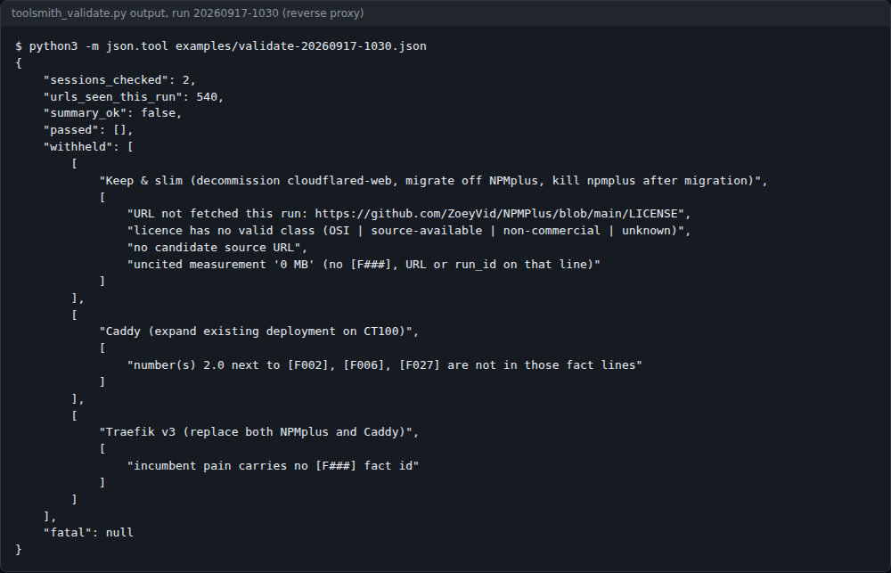
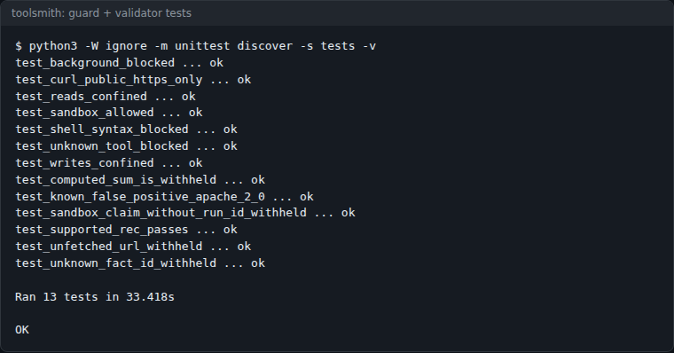
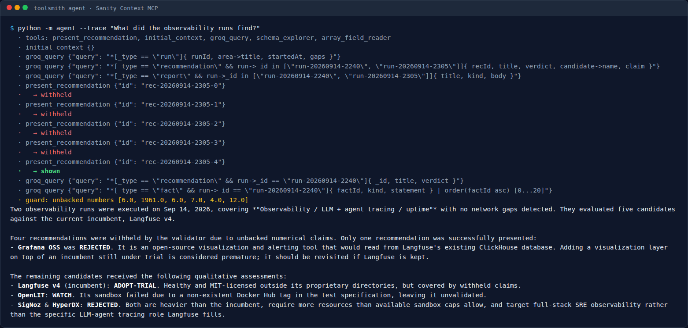
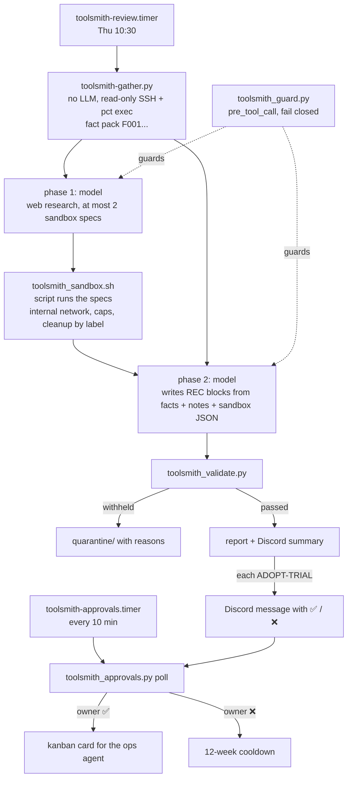
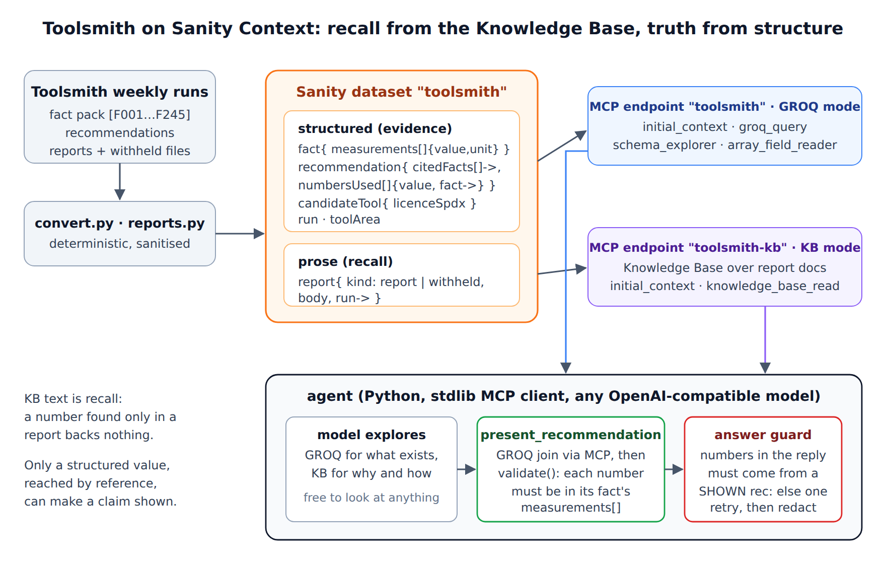
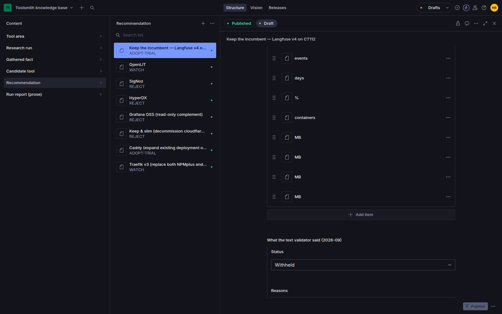

# toolsmith

A weekly research agent for a self-hosted homelab that asks whether there is a better tool than the one
you run, tests the candidates in a capped Docker sandbox with no egress by default, and withholds any recommendation it can't back
with measured facts.



*The validator's real output from the week-2 run (`examples/validate-20260917-1030.json`). Every
recommendation was withheld, so nothing reached the owner. One of the three was a false positive; see
[Real results](#status-limits-and-real-results).*


## Contents

- [What it does](#what-it-does)
- [Screenshots](#screenshots)
- [Quick start](#quick-start)
- [Usage](#usage)
- [Configuration](#configuration)
- [How it works](#how-it-works)
- [Sanity knowledge base](#sanity-knowledge-base)
- [Status, limits and real results](#status-limits-and-real-results)
- [Licence and credits](#licence-and-credits)

## What it does

- Picks one area of the estate each week (observability, reverse proxy, backups and so on, from
  `data/areas.json`) and only if the live inventory has an incumbent in that area.
- Measures the estate with no LLM involved: `toolsmith-gather.py` reads every container on every Proxmox
  node over SSH and `pct exec`, read-only, and writes a numbered fact pack (`[F001]`, `[F002]` ...).
- Has the model research 3–5 candidates plus "keep the incumbent", then runs up to two of them in a
  throwaway Docker sandbox with no network egress by default. The script runs the sandbox, not the model.
- Validates the model's report against the fact pack, the sandbox JSON and the URLs it really fetched.
  Anything unsupported is withheld and quarantined with its reasons.
- Posts each surviving `ADOPT-TRIAL` to Discord as its own message. Only the owner's ✅ or ❌ counts. A ✅
  creates a kanban card for an ops agent; nothing changes production on its own.
- Guards every tool call with a fail-closed `pre_tool_call` hook, because the Hermes box holds root SSH
  keys to the Proxmox nodes.

It runs as a profile of [Hermes Agent](https://github.com/NousResearch/hermes-agent) (the `hermes` CLI)
against Proxmox LXC containers. It was built for one estate and it shows. This repo is that code with the
estate details moved into a config file, plus the real results so far.

## Screenshots



*`python3 -m unittest discover -s tests -v` from a fresh clone, 2026-10-08 (class names trimmed from each
line). The tests cover the guard's allow/block decisions and the validator's main withhold paths, including
the known `Apache-2.0` false positive.*



*The [Sanity knowledge base](#sanity-knowledge-base) agent answering "What did the observability runs
find?" with `--trace`. Four recommendations come back withheld, one shown, and the answer guard flags the
numbers it can't back.*

## Quick start

You need:

- a working Hermes Agent install (profiles, `pre_tool_call` shell hooks, plugins, `kanban`)
- Python 3.11+ with `requests` and `PyYAML` (the Hermes venv has both)
- root SSH key access from the Hermes box to your Proxmox nodes
- Docker, `curl` and `systemd-run` inside the CTs you allow as sandbox hosts
- a Discord bot token

The tests need nothing but the standard library, so start there:

```bash
git clone https://github.com/casareanderson/toolsmith && cd toolsmith
python3 -m unittest discover -s tests      # 13 tests, ends with OK
```

Then install into Hermes:

```bash
HERMES_HOME=/root/.hermes ./install.sh        # copies scripts, renders SOUL/config, never overwrites
$EDITOR /root/.hermes/toolsmith/toolsmith.conf
$EDITOR /root/.hermes/profiles/toolsmith/config.yaml   # OLLAMA_HOST, model choice
mkdir -p /etc/toolsmith && install -m 600 /dev/null /etc/toolsmith/secrets.env
echo 'TOOLSMITH_DISCORD_BOT_TOKEN=...' >> /etc/toolsmith/secrets.env
```

`install.sh` prints the next steps. Success is `toolsmith_sandbox.sh refuse-test` refusing, and
`toolsmith-review.sh --no-post` writing a report and a validator JSON without posting anything.

Then copy `systemd/*` to `/etc/systemd/system/`, fix the paths if yours differ, and
`systemctl enable --now toolsmith-review.timer toolsmith-approvals.timer`.

`profile/SOUL.md` contains `__SCRIPTS__` / `__TOOLSMITH_HOME__` placeholders. `install.sh` fills them in,
because the model has to know the exact sandbox path the guard allows.

## Usage

```bash
S=/root/.hermes/scripts
$S/toolsmith_sandbox.sh hosts            # which sandbox hosts qualify, and why the others don't
$S/toolsmith_sandbox.sh refuse-test      # asks for a 2048 MB cap; should be refused
$S/toolsmith_sandbox.sh sweep            # remove anything carrying a toolsmith label
$S/toolsmith-gather.py --list-areas      # what the weekly rotation will be
$S/toolsmith-review.sh --area reverse-proxy --no-post   # full run for one area, nothing sent
python3 $S/toolsmith_approvals.py post-test   # post a labelled TEST message to prove the ✅ loop
python3 $S/toolsmith_approvals.py list        # pending, approved, rejected and expired records
```

The two timers do the rest: `toolsmith-review.timer` runs on Thursdays at 10:30, and
`toolsmith-approvals.timer` polls Discord reactions every 10 minutes.

## Configuration

Everything site-specific is in `toolsmith.conf` (default `~/.hermes/toolsmith/toolsmith.conf`, or point
`TOOLSMITH_CONF` at it). See [`toolsmith.conf.example`](toolsmith.conf.example). Environment variables with
the same name override the file. The only secret, `TOOLSMITH_DISCORD_BOT_TOKEN`, is read from the
environment only. A line for it in the conf file is ignored on purpose.

| key | default | what it does |
|---|---|---|
| `TOOLSMITH_DISCORD_BOT_TOKEN` | none (env only) | bot token for posting and reading reactions |
| `TOOLSMITH_DISCORD_CHANNEL_ID` | none | where the weekly summary and approval messages go |
| `TOOLSMITH_OWNER_DISCORD_ID` | none | the only user whose ✅/❌ counts; empty means the poller refuses to run |
| `TOOLSMITH_REJECT_COOLDOWN_WEEKS` | `12` | a ❌ candidate is not re-proposed for this long |
| `TOOLSMITH_APPROVAL_EXPIRY_DAYS` | `14` | a pending approval with no owner reaction expires after this |
| `TOOLSMITH_KANBAN_BOARD` / `TOOLSMITH_KANBAN_ASSIGNEE` | `it` / `coder` | where an approved card goes |
| `TOOLSMITH_PROXMOX_NODES` | none | `name=ip ...` nodes to inventory as root with key auth |
| `TOOLSMITH_SSH_HOSTS` | none | extra docker hosts, `label=user@host ...` |
| `TOOLSMITH_OLLAMA_HOSTS` / `TOOLSMITH_HOST_UNITS` | none / `ollama comfyui` | hosts that also get an Ollama `/api/ps` and systemd unit probe |
| `TOOLSMITH_SELF_NODE` / `TOOLSMITH_SELF_CT` | none | how the Hermes box itself is labelled in the inventory |
| `TOOLSMITH_NOTES_DIR` / `TOOLSMITH_NOTES_SSH` / `TOOLSMITH_KB_LESSONS` | none | where "recorded incidents" come from; empty prints `NOT MEASURED` |
| `TOOLSMITH_LANGFUSE_NODE` / `TOOLSMITH_LANGFUSE_CT` | none | the example deep probe for the observability area |
| `TOOLSMITH_SANDBOX_HOSTS` | none | `node_ip:ct:name:note;...` sandbox hosts in preference order |
| `TOOLSMITH_EXCLUDED_HOSTS` | none | `node_ip:ct=reason;host=reason` never-hosts, so a refusal is explicit |
| `TOOLSMITH_EXTRA_ENV_FILES` | none | more `.env` files whose values a sandbox spec may never contain |
| `TOOLSMITH_PRIVATE_DOMAINS` | none | your own domains; the guard never lets `curl` reach them |
| `TOOLSMITH_HOME` | `$HERMES_HOME/toolsmith` | runs, sandbox JSON, reports, quarantine |
| `TOOLSMITH_PROFILE` | `toolsmith` | the Hermes profile name |
| `HERMES_HOME` / `HERMES_BIN` / `HERMES_VENV` / `HERMES_SRC` | `~/.hermes`, `/usr/local/bin/hermes`, `/usr/local/lib/hermes-agent/venv`, `/usr/local/lib/hermes-agent` | Hermes paths |

`data/areas.json` sets the rotation (12 areas) and their keywords. `data/preferences.json` holds owner
preferences. Each one is printed only while its quote can still be found in its source file, and printed
as `UNVERIFIED` once it can't.

**Choosing sandbox hosts:** run `toolsmith_sandbox.sh hosts` and pick by the numbers. The author excluded
the house-critical CT, the CT running the incumbent under evaluation, the NAS (rootfs 100%) and the GPU
host, and put an SSD-backed docker CT ahead of an HDD one.

## How it works



### The fact pack

`toolsmith-gather.py` is the only thing that states facts about the estate. It finds every running
container on every Proxmox node and extra SSH host, and records memory, restarts, health and image for
each, plus host capacity (RAM, rootfs, storage pools, and whether each disk is rotational). It also picks
up dated lines from the operator's own notes as "recorded incidents", the owner's standing preferences,
and earlier approval decisions. Every line gets an id. When something can't be measured, the pack says
`NOT MEASURED` and gives the reason, so a gap is never silent.

The model is told that estate facts come **only** from this pack and must carry their `[F###]` id. See
[`examples/facts-excerpt-reverse-proxy.txt`](examples/facts-excerpt-reverse-proxy.txt) for a real one.

### The validator

`toolsmith_validate.py` reads the model's report and withholds a `### REC n:` block when the block:

- cites a fact id that isn't in the pack
- quotes a number beside a fact id when that number isn't in the cited fact line(s)
- names a CT id or private IP that isn't in the pack
- has no measured incumbent pain with a fact id
- cites any URL that doesn't appear in this run's tool calls (read from Hermes' `state.db`)
- has no licence line with SPDX/name + class + source URL
- claims a sandbox result without a run_id, cites a run_id with no sandbox JSON, or quotes sandbox numbers
  the JSON doesn't contain
- has no `ADOPT-TRIAL | WATCH | REJECT` verdict

A withheld block isn't sent with a caveat. It goes to `quarantine/` with its reasons, and the Discord
summary only says it was withheld. If the model's summary paragraph fails, it is replaced by a
deterministic list of the blocks that passed.

### The sandbox

`toolsmith_sandbox.py` is the only way a candidate ever runs.

- It picks a docker host CT **by measurement** before every run: rootfs ≤ 80%, CT *and* node
  MemAvailable ≥ 2× the memory cap, disk ≥ 2× the max image size, and no other toolsmith container live.
  Excluded hosts are refused by name.
- `--memory`/`--memory-swap`, `--cpus` and `--pids-limit` are always set, with `no-new-privileges` and a
  few caps dropped. Never privileged, never host network, never bind mounts or devices, only tmpfs.
- The default network is `docker network create --internal`: no LAN, no internet. A spec can set
  `egress: true`, and then the port is published on 127.0.0.1 only.
- Env values that look secret (`KEY|SECRET|TOKEN|PASS|...`) must start with `toolsmith-dummy-`, and no
  value may equal any value in a Hermes `.env`.
- Everything carries an `io.hermes.toolsmith.run=<run_id>` label. Cleanup removes **by label only**, in a
  `finally`, again via a `systemd-run` reaper inside the CT if the process dies, and with `sweep`. It
  snapshots every *other* container, image and volume on the host before and after, and `verified_clean`
  is true only if none of them changed.
- It writes `sandbox/<run_id>.json` with pull time, image size, startup time, memory, the last log lines
  and the cleanup proof.

### The guard hook

An instruction in a prompt is not a control. `toolsmith_guard.py` runs as a `pre_tool_call` hook with
`fail_closed: true`:

- tools are allow-listed by name
- `terminal` may run the sandbox script, a few read-only commands inside the toolsmith tree, or a `curl`
  GET to one public `https://` host. No shell metacharacters, no bare IPs, no `.lan`/`.local`/`.internal`,
  and none of your own domains (`TOOLSMITH_PRIVATE_DOMAINS`)
- reads stay inside the toolsmith tree, writes stay inside its workspace
- a crash, timeout or unparseable payload **blocks**

### Approvals

`toolsmith_approvals.py` posts each validated ADOPT-TRIAL as its own message with ✅ and ❌ already added by
the bot, then polls. Only the reactions of `TOOLSMITH_OWNER_DISCORD_ID` count. Everyone else's are ignored,
including the bot's own pre-added ones, which matters because the bot shows up in every reactor list. If
the owner reacts with both, the message stays pending.

✅ creates a kanban card whose body is a staged plan: re-verify, plan, **stop and ask before deploying**,
run alongside the incumbent for 7 days, and treat retiring the incumbent as a separate decision. ❌ records
a 12-week cooldown. After 14 days with no owner reaction, the message expires.

### Project structure

```
scripts/
  toolsmith-review.sh        weekly orchestrator: gather, phase 1, sandbox, phase 2, validate, deliver
  toolsmith-gather.py        the fact pack (no LLM)
  toolsmith_sandbox.py/.sh   host selection, capped no-egress runs, cleanup proof
  toolsmith_validate.py      withholds unsupported REC blocks
  toolsmith_guard.py         fail-closed pre_tool_call hook
  toolsmith_approvals.py     Discord ✅/❌ loop, kanban cards, cooldowns
  toolsmith_discord.py       Discord REST helpers
  toolsmith_config.py        toolsmith.conf + env loader
profile/                     Hermes profile: SOUL.md, config.yaml.example, PII-scrub plugin
data/                        areas.json (rotation), preferences.json
systemd/                     review (weekly) and approvals (10 min) units
examples/                    sanitised real reports, quarantine files, validator and sandbox JSON
sanity/                      Sanity Context MCP knowledge base (see below)
tests/                       guard + validator tests (stdlib only)
install.sh                   idempotent installer
```

## Sanity knowledge base

`sanity/` turns the run artefacts into a Sanity dataset and puts an agent in front of it. It was built for
the Sanity Context MCP challenge.



- `sanity/convert/convert.py` and `reports.py` turn runs into NDJSON (`sanity/data/`), deterministically.
  Every number in a fact becomes a typed measurement. Licence ids, versions and protocol names such as
  `Apache-2.0` and `DNS-01` do not, which is the fix for the text validator's false positive.
- `sanity/agent` lets the model explore the dataset freely through Context MCP, but it can only present a
  recommendation through `present_recommendation`, which joins in the cited facts and runs
  `validator.validate()`. Numbers in the final answer that no shown recommendation backs are sent back
  once, then replaced with `[not verified]`.
- `sanity/studio` is the Sanity Studio schema.



*The "keep Langfuse" recommendation in Sanity Studio, still withheld.*

```bash
cd sanity
python3 -m pytest -q tests convert           # 27 tests
export SANITY_CONTEXT_MCP_URL=... SANITY_CONTEXT_TOKEN=... OPENROUTER_API_KEY=...
python3 -m agent --trace "Should we replace our reverse proxy?"
```

| env var | default | what it does |
|---|---|---|
| `SANITY_CONTEXT_MCP_URL` | none | Context MCP endpoint for GROQ mode |
| `SANITY_CONTEXT_KB_URL` | none | optional second endpoint serving the Knowledge Base (prose reports) |
| `SANITY_CONTEXT_TOKEN` | none | organisation token with Context Viewer |
| `OPENROUTER_API_KEY` or `LLM_API_KEY` | none | key for the model endpoint |
| `LLM_BASE_URL` | `https://openrouter.ai/api/v1` | any OpenAI-compatible endpoint |
| `LLM_MODEL` | `qwen/qwen3.7-flash` | model used by the agent |

More screenshots are in [`docs/sanity/`](docs/sanity).

## Status, limits and real results

Experimental, and run weekly on one estate. **After two weekly runs, 8 recommendations were written, 3 were
published (all REJECT), 5 were withheld, and not one ADOPT-TRIAL has reached the owner.** Some of those
withholds were correct and some were false positives.

All of this comes from the run directories on the author's box. Sanitised copies of the reports,
quarantine files, sandbox JSON and a fact-pack excerpt are in [`examples/`](examples).

### Sandbox self-tests, 2026-09-14

| run_id | what | result |
|---|---|---|
| `ts-20260914-222042-5a8f` | `refuse-test`: asks for a 2048 MB cap | **refused**: no host had 4096 MB MemAvailable (CT 1585 MB, node 2403 MB; second host 2340 MB) |
| `ts-20260914-222049-d83f` | `traefik/whoami:v1.10` | healthy; pull 4.0 s, image 2.7 MB, startup 3.6 s, 1.2 MB RAM; cleanup verified |
| `ts-20260914-222141-6fd5` | `busybox:1.37` egress probe | `wget` to a LAN address: `Network is unreachable` → `LAN_BLOCKED`; to 1.1.1.1: `NET_BLOCKED`; cleanup verified |

The approval loop was tested with a labelled TEST message. The owner's ✅ created a card, and the poll
recorded 2 ✅ reactors, 1 ❌ reactor, and 1 ignored non-owner reaction (the bot's own).

### Week 1: observability (run `20260914-2305`)

158 facts. The validator found 627 distinct URLs in the run's tool calls, across 2 sessions.

| REC | verdict | validator |
|---|---|---|
| Keep the incumbent (Langfuse) | ADOPT-TRIAL | **withheld**: "~15 MB disk [F054]-[F055]" is a sum the model worked out, not a number in either fact; also no candidate source URL |
| OpenLIT | WATCH | **withheld**: "3" (components, from the vendor docs) sat in a clause citing [F021][F046] |
| SigNoz | REJECT | passed |
| HyperDX | REJECT | passed |
| Grafana OSS | REJECT | passed |

The summary paragraph was withheld too (same "15", plus a "2.0"). So the published report is three
REJECTs, and the "keep Langfuse" recommendation never reached the owner.

Sandbox, same run:

- `ts-20260914-230927-e882`, OpenLIT: **failed**. The model's spec used `openlit/backend:openlit-2.1.0`,
  which doesn't exist (`pull access denied ... repository does not exist`). The phase-1 prompt says to take
  the image and tag from a fetched source, and it made one up anyway. The report itself later said the
  official image is `ghcr.io/openlit/openlit:latest`. OpenLIT was never actually tested.
- `ts-20260914-230938-13d6`, ClickHouse 25.12 as OpenLIT's companion: image 235.3 MB, pulled in 13.7 s,
  then `Aborted (core dumped)` under a 512 MB cap, so **unhealthy**. The report correctly listed this under
  "What I could not establish" rather than blaming ClickHouse.
- Both runs: `verified_clean: true`.

The first attempt that evening (`20260914-2240`) gathered the same 158 facts and produced an empty research
phase (0 bytes). The PII 403 and the local-model context overflow (traps 1 and 3 below) were both found
while debugging that evening.

One passed block reads `Candidate: GNU [PERSON_NAME] OSS` where it should say Grafana. The toolsmith
scrubber only ever writes `[email removed]` / `[phone removed]`, so that placeholder was added upstream of
toolsmith. The validator checks numbers, ids and URLs, not wording, so it went through.

### Week 2: reverse proxy (run `20260917-1030`)

99 facts, 540 URLs seen, no sandbox specs proposed, 380 s end to end. **Every recommendation was withheld**,
so nothing was posted for approval:

| REC | verdict | withheld because | fair? |
|---|---|---|---|
| Keep & slim | REJECT | cited a LICENSE URL it never fetched; no licence class; no candidate URL; uncited "0 MB" | yes |
| Caddy (expand existing) | ADOPT-TRIAL | "2.0" next to [F002][F006][F027] | **no**: the 2.0 is from "Apache-2.0" |
| Traefik v3 | WATCH | incumbent pain has no fact id | yes |

Summary withheld: "~24 MB combined [F012][F013]" is 10.9 + 13.3 added up by the model (a correct withhold),
and "01" next to [F049][F074] comes from "DNS-01" (a false positive).

Across the two runs, 3 of the 5 withheld recommendations were withheld for sound reasons, one (Caddy) was a
clear false positive, and one (OpenLIT's "3 components") is arguable. The only ADOPT-TRIAL either run
produced was lost to a false positive. The text validator's number matcher is token-based, so version and
protocol strings next to a fact id trip it. `tests/` includes that case as a known limitation. It has not
been fixed in the text validator; the Sanity version types measurements instead.

### Traps it found

1. **OpenRouter `403 Request blocked: PII detected (invalid_json_after_redaction)`.** It hit
   `qwen/qwen3.7-flash` and `deepseek/deepseek-v4-flash-0731` as soon as `web_search` results (web pages
   containing emails and phone numbers) entered the context. The fact pack alone passed. The fallback chain
   then quietly ran the whole research phase on a local model at 45–156 s per call. Fix:
   `profile/plugins/toolsmith-pii-scrub`, a `transform_tool_result` hook that replaces emails and phone
   numbers in `web_*` results before the model sees them. Any research agent that routes through OpenRouter
   can hit this.
2. **A Hermes profile's `config.yaml` doesn't inherit the global `web:` block.** Web search fell back to a
   backend that wasn't running and returned 404s. Fix: set `web:` in the profile (it's in
   `config.yaml.example`).
3. **A local 64k-context model overflows** on the long research phase. Keep it last in the fallback chain.
4. **The model invents image tags.** The sandbox catches it (the pull fails), but that costs the test slot.
5. **`Persistent=false` on the weekly timer** meant a reboot at 12:03 on a Thursday silently skipped that
   week's 10:30 run. The unit here ships with `Persistent=true`.

### What it does not do

- It never deploys anything. An approved card is a plan for a human-supervised ops agent.
- It doesn't sandbox more than two candidates a run (`toolsmith-review.sh` keeps the first two specs).
- It assumes Hermes Agent and Proxmox LXC. There is no standalone mode.

### What was cut for publication

- Estate addresses, host names, CT layout, Discord ids and notes paths now live in `toolsmith.conf`.
- The Discord token came from an estate-internal notifier module. It now comes from an environment variable.
- The observability probe also listed a host timer specific to the author's estate. That part is removed.
- The approved-card template had the estate's SSH access paths hard-coded. It now reads an optional
  `card-access.txt`.
- The validator's IP check looked for one /24. It now covers all RFC 1918 ranges.
- Examples are sanitised (documentation IPs `192.0.2.x`, generic host names). The reverse-proxy quarantine
  file is cut down to the lines that caused each withhold.

## Licence and credits

MIT. See [LICENSE](LICENSE).

- Runs on [Hermes Agent](https://github.com/NousResearch/hermes-agent) by Nous Research.
- The knowledge base uses [Sanity](https://www.sanity.io/) Studio and Context MCP.
- Models named above (via OpenRouter and Ollama) are configured in `profile/config.yaml.example`; none
  are shipped here.
